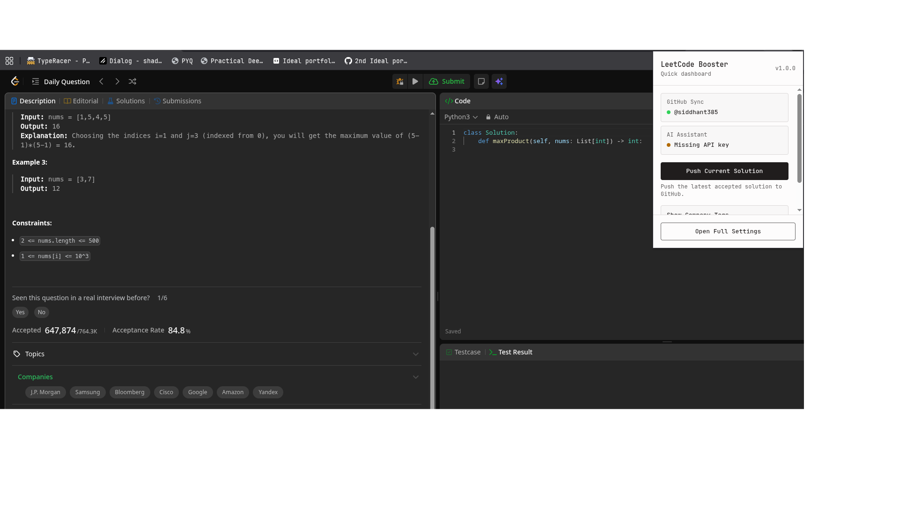

# LeetCode+

> A powerful browser extension that enhances your LeetCode experience by unlocking premium features and supercharging your workflow for free.

## 🚀 Features

> - [x] Completed
> - [ ] Upcoming 

- [x] **LLM-Powered Solution Analysis:** Get instant insights, code reviews, and time/space complexity breakdowns for your accepted solutions (a free alternative to LeetCode Premium AI).
- [x] **Company Tags:** Unlock hidden company tags directly on the problem description page.
- [x] **GitHub Auto-Sync:** Automatically commit and sync your accepted submissions to a linked GitHub repository—complete with auto-generated stat badges for your GitHub profile!
- [ ] **Company Questions:** Unlock hidden company questions for problem sets.
- [ ] **Live Rating Prediction:** Get your contest rating prediction instantly and live, much earlier than LeetCode's official update.

## 💻 Tech Stack
Built with modern web standards to ensure security, speed, and maintainability:
- **UI/Framework:** React 18, TypeScript, Tailwind CSS
- **State & Validation:** Zod (for highly robust extension storage schema)
- **Architecture:** Manifest V3, modular feature injection, and `webext-msg` for seamless cross-context communication.

## 🌍 Available For

## ⚠️ Known Limitations
> Contributions are always welcome!
- The LLM-Powered Solution Analysis currently works only on **Accepted** solutions.

## 📚 References & Inspiration
- [Refined GitHub](https://github.com/refined-github/refined-github) (Major inspiration and source for learning extension architecture)
- [Leetcode-premium-Bypass](https://github.com/31b4/Leetcode-Premium-Bypass)
